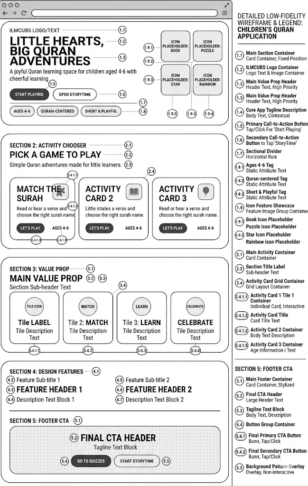
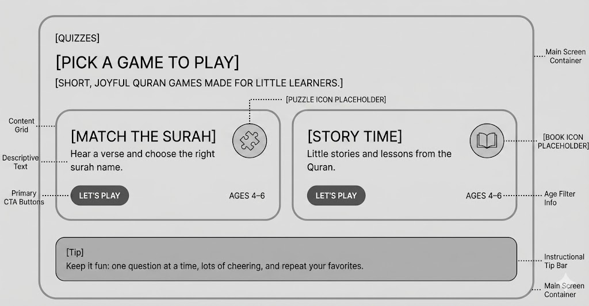
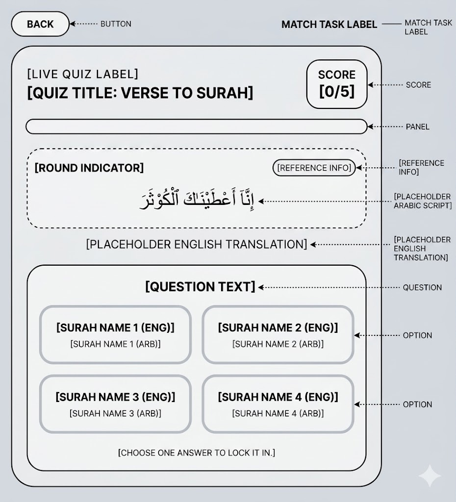
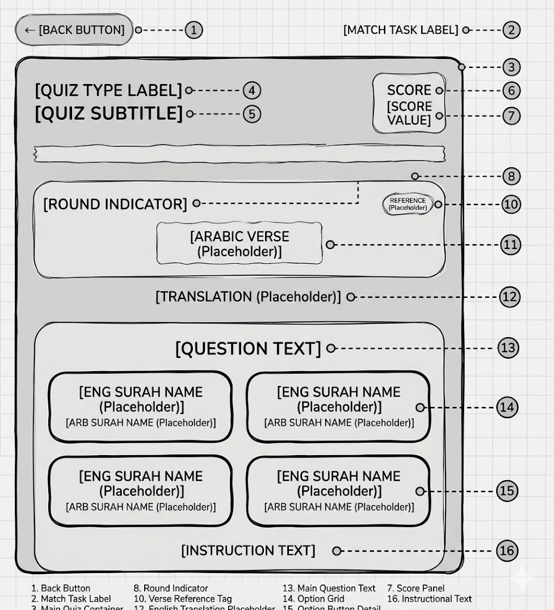

# IlmCubs App Wireframes

This document captures low-fidelity wireframes for the current app flow.

Routes covered:

- Entry screen: `/`
- Mode select screen: `/quizzes`
- Story time screen: `/storytime`
- Quiz play screen: `/quizzes/match-the-surah`

Attached image references used for this document:

- Image 1: homepage / entry wireframe with legend
- Image 2: quiz screen reference with clean labeled layout
- Image 3: quiz screen reference with numbered annotations
- Image 4: mode select / activity chooser reference

## 1. Entry Screen

Route: `/`

Purpose:

- Welcome children and parents into the app
- Introduce the playful Quran-first learning experience
- Provide clear first actions

Reference image:

- Use attached Image 1 for the visual layout of this screen

Wireframe image:



Key content blocks:

- Brand/logo area
- Main headline and supporting text
- Two primary CTAs
- Trust or audience tags
- Featured activity cards
- Reinforcing value section
- Footer CTA

Primary interactions:

- `Start Playing` takes the user to `/quizzes`
- `Open Storytime` takes the user to `/storytime`
- Activity cards can deep link into the relevant mode

## 2. Mode Select Screen

Route: `/quizzes`

Purpose:

- Let the child or parent choose what kind of activity to start
- Keep the choice simple and visually obvious

Reference image:

- Use attached Image 4 for the visual layout of this screen

Wireframe image:



Key content blocks:

- Section label
- Simple headline
- Two large cards
- Clear age guidance
- Parent tip bar

Primary interactions:

- Match the Surah card opens `/quizzes/match-the-surah`
- Story Time card opens `/storytime`

## 3. Story Time Screen

Route: `/storytime`

Purpose:

- Present one focused story experience at a time
- Keep reading/listening calm, warm, and uncluttered

Reference source:

- Derived from the entry and mode-select wireframes you attached
- Story Time card in Image 4 is the main visual reference for tone and hierarchy

Wireframe image:



Key content blocks:

- Back navigation
- Story label and title
- Illustration or icon area
- Story content body
- Simple lesson recap
- One or two strong CTAs

Primary interactions:

- Back returns to `/quizzes`
- `Read Aloud` can trigger audio if supported later
- `Next Story` advances to another story

## 4. Quiz Page

Route: `/quizzes/match-the-surah`

Purpose:

- Show one verse challenge at a time
- Keep score visible
- Make answer selection simple and touch-friendly

Reference images:

- Use attached Image 2 for the main quiz layout
- Use attached Image 3 for the numbered annotation version of the same screen

Wireframe images:



Key content blocks:

- Back button
- Quiz mode label
- Score panel
- Progress bar
- Verse card with round and reference
- Translation text
- Four answer buttons
- Instruction or feedback area

Primary interactions:

- Tap one answer to submit the round
- Show correct/incorrect feedback
- `Next verse` advances to the next round
- Final state shows score summary and replay option

## Embedded Reference Blocks

These are the attached image callouts captured in markdown so the source document stays useful even when the chat attachments are not visible.

### Entry Screen Image

```text
[Attached Image 1]
Children's Quran application homepage wireframe with:
- logo area
- hero headline
- start playing and open storytime buttons
- age and content tags
- activity chooser cards
- value prop tiles
- footer CTA
```

### Mode Select Image

```text
[Attached Image 4]
Quizzes screen wireframe with:
- section label: Quizzes
- heading: Pick a game to play
- two cards: Match the Surah and Story Time
- primary Let's Play buttons
- ages 4-6 tags
- parent tip bar
```

### Quiz Screen Images

```text
[Attached Image 2]
Quiz play screen showing:
- back button
- match task label
- score panel
- progress area
- round indicator
- verse reference chip
- Arabic verse
- English translation
- question prompt
- four answer options
- instruction text
```

```text
[Attached Image 3]
Annotated version of the quiz play screen showing the same layout with numbered
labels for back button, score, round indicator, verse reference, translation,
question text, option grid, and instruction text.
```

## Notes For Implementation

- Keep layouts centered inside a rounded main card, especially for `/quizzes`, `/storytime`, and `/quizzes/match-the-surah`.
- Favor very large tap targets and clear labels for ages 4-6.
- Preserve a single-primary-action pattern on each screen.
- Where possible, mirror the current route names so the doc stays implementation-friendly.
